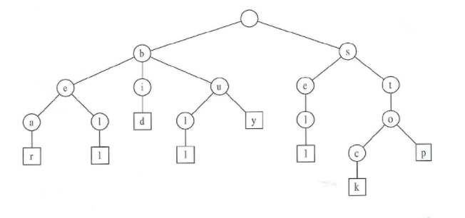

# Trie

> 2020.11.15


#### 트라이

> 문자열 검색을 빠르게 도와주는 자료구조
>
> 이진탐색트리와 비슷하지만 문자열의 길이가 M이라면,
>
> 해당 문자열을 탐색하는데 소요되는 시간은 O(M*logN)이 된다.
>
> 트라이를 사용하면 O(M)으로 탐색할 수 있다.



**구현 in 카카오 코딩테스트 가사검색**

```python
class Node():
    def __init__(self,key):
        self.key=key
        self.length_remain = {}
        self.child={}
class trie():
    def __init__(self):
        self.head=Node(None)
    def insert(self,words):
        node=self.head
        l=len(words)
        node.length_remain[l]=node.length_remain.get(l,0)+1
        for word in words:
            if word not in node.child:
                node.child[word]=Node(word)
            node=node.child[word]
            l-=1
            node.length_remain[l] = node.length_remain.get(l, 0) + 1
    def search(self,words,leng):
        node=self.head
        if len(words)+leng not in node.length_remain:   return 0
        for word in words:
            if word not in node.child: return 0
            node=node.child[word]
        return node.length_remain.get(leng,0)
def solution(words,queries):
    t,t_rev=trie(),trie()
    answer=[]
    for word in words:
        t.insert(word)
        t_rev.insert(word[::-1])
    for query in queries:
        leng=len(query)
        if query[0]=='?':
            query=query[::-1]
            query=query[:query.find('?')]
            answer.append(t_rev.search(query,leng-len(query)))
        else:
            query = query[:query.find('?')]
            answer.append(t.search(query,leng-len(query)))
    return answer
words=["frodo", "front", "frost", "frozen", "frame", "kakao"]
queries=["fro??", "????o", "fr???", "fro???", "pro?"]
print(solution(words,queries))
```


**[참고]**

- https://gyoogle.dev/blog/computer-science/data-structure/Trie.html

